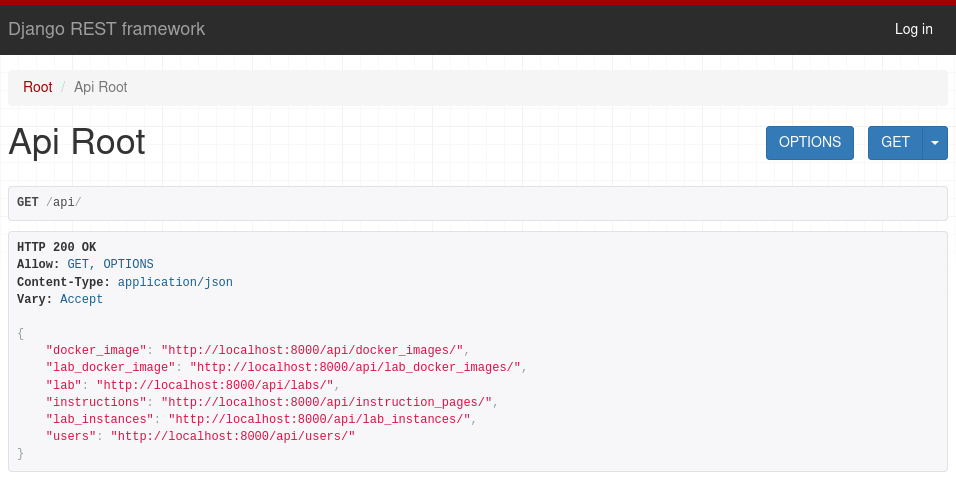
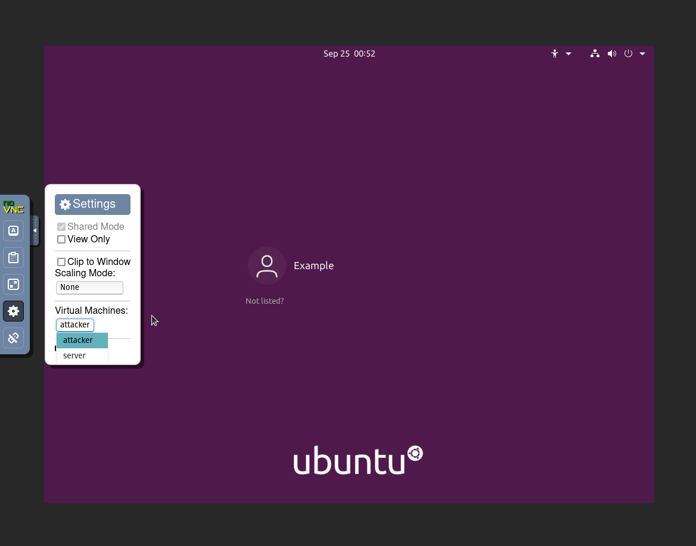

[](https://github.com/laborchestrator/laborchestrator/issues)
[](https://github.com/LabOrchestrator/LabOrchestrator)


# LabOrchestrator

The Lab Orchestrator is a tool that helps you to orchestrate labs.

## Introduction

A lab is a combination from multiple VMs that share a network. When you start a lab, the VMs are started in Kubernetes with KubeVirt in a separate namespace so that you aren't able to connect to labs from other people. You can access the VMs over VNC in the browser with LabVNC. Labs can be created by admins and started by anyone. In addition to the VNC connection you can add instructions. This is especially useful for teaching purposes.

The LabOrchestrator can be used by anyone who wants to start VMs in a network that should be separeted by users. use cases of this library would be for example a lecturer who wants to provide vms for his students or a company or association who wants to learn security testing in a secure environment.

The Lab Orchestrator project is divided into multiple subprojects and this repository aims to provide a small introduction into all of them and Kubernetes files to deploy them all at once.


## Installation

Take a look at the [project documentation](https://github.com/LabOrchestrator/LabOrchestrator-Documentation/blob/main/documentation.pdf). The topic "3. Installation" shows how to install the lab orchestrator with prerequisites in development and production environments.

## Usage

**Using minikube:**

Execute `minikube service -n lab-controller lab-controller-api`. This will open the Browsable API. There you need to login with your admin account. First add docker images containing the VMs you want to use. Then create a lab referring to the docker image you want. After that you can start the lab in the lab instances view.

## Structure

The project contains three main parts:
- [LabOrchestrator-API](https://github.com/LabOrchestrator/LabOrchestrator)
- [WebsocketProxy](https://github.com/LabOrchestrator/WebsocketProxy)
- [LabVNC](https://github.com/LabOrchestrator/LabVNC)

The Documentation can be found here:
- [LabOrchestrator](https://github.com/LabOrchestrator/LabOrchestrator) (Short Documentation and deployment files for Kubernetes)
- [LabOrchestrator-Documentation](https://github.com/LabOrchestrator/LabOrchestrator-Documentation) (Long Documentation)

There are also some libraries that are included in those main parts:
- [LabOrchestratorLib](https://github.com/LabOrchestrator/LabOrchestratorLib)
- [LabOrchestratorLib-Auth](https://github.com/LabOrchestrator/LabOrchestratorLib-Auth)
- [LabOrchestratorLib-DjangoAdapter](https://github.com/LabOrchestrator/LabOrchestrator)
- [LabOrchestratorLib-FlaskSQLAlchemyAdapter](https://github.com/LabOrchestrator/LabOrchestratorLib-FlaskSQLAlchemyAdapter)
- [WebsocketProxyLib](https://github.com/LabOrchestrator/WebsocketProxyLib)

## Main Parts

### LabOrchestrator-API


[](https://hub.docker.com/r/biolachs2/lab_orchestrator/tags)
[](https://github.com/LabOrchestrator/laborchestrator-api/blob/main/LICENSE)
[](https://github.com/laborchestrator/laborchestrator-api/issues)
[](https://hub.docker.com/r/biolachs2/lab_orchestrator)

[Github](https://github.com/LabOrchestrator/LabOrchestrator-api)  
[Docker Hub](https://hub.docker.com/r/biolachs2/lab_orchestrator)

This is the API that controls the Kubernetes cluster, starts and stops VMs and manages all other resources for example labs and users.
The LabOrchestrator-API is a Django-Rest-Framework (DRF) application that gives us access to all functionality in the LabOrchestratorLib.



### WebsocketProxy

[](https://pypi.org/project/lab-orchestrator-ws-proxy/)
[](https://hub.docker.com/r/biolachs2/lab_orchestrator_ws_proxy/tags)
[](https://github.com/LabOrchestrator/WebsocketProxy/blob/main/LICENSE)
[](https://github.com/laborchestrator/WebsocketProxy/issues)
[](https://hub.docker.com/r/biolachs2/lab_orchestrator_ws_proxy)
[](https://libraries.io/pypi/lab-orchestrator-ws-proxy)
[](https://websocketproxy.readthedocs.io/en/latest/)

[Github](https://github.com/LabOrchestrator/WebsocketProxy)  
[PyPi](https://pypi.org/project/lab-orchestrator-ws-proxy/)  
[Docker Hub](https://hub.docker.com/repository/docker/biolachs2/lab_orchestrator_ws_proxy)  

When a VM is started kubvirt automatically starts a VNC server for this VM. The WebsocketProxy adds authentication to this, so that only authorized users are able to connect to their VMs. To use it you need to connect to the service and the path must contain the token and the VM name separated by a slash: `localhost:30002/ABCDEFTOKENGHIJKLM/ubuntu`. The token is shown when you start the lab. One token can be used to access all VMs in this lab.

### LabVNC


[](https://hub.docker.com/r/biolachs2/lab_orchestrator_novnc/tags)
[](https://github.com/LabOrchestrator/laborchestratorlib-djangoadapter/blob/main/LICENSE)
[](https://github.com/laborchestrator/labvnc/issues)
[](https://hub.docker.com/r/biolachs2/lab_orchestrator_novnc)

[Github](https://github.com/LabOrchestrator/LabVNC)  
[Docker Hub](https://hub.docker.com/r/biolachs2/lab_orchestrator_novnc)

The LabVNC deploys [noVNC](https://github.com/novnc/noVNC) with some additions. With this part it's possible to open a VNC connection in your browser. To use it you need to open lab_vnc.html. Then set the parameters host to the ip of the WebsocketProxy, port to the port of the WebsocketProxy and path to the token and VM name as described above. If the WebsocketProxy is run behind a proxy you can attach a host name prefix to the path. There are other optional parameters listed [here](https://github.com/novnc/noVNC/blob/master/docs/EMBEDDING.md). A URL can look like this: `localhost:30003/lab_vnc.html?host=localhost&port=30002&path=ABCDEFTOKENGHIJKLM/ubuntu` or behind a proxy like this: `yoursite.com/lab_vnc.html?host=yoursite.com&port=30002&path=wsproxy/ABCDEFTOKENGHIJKLM/ubuntu`. In the left sidebar in the settings you are able to switch the VMs in a lab.



## Documentation

### LabOrchestrator


[](https://github.com/laborchestrator/laborchestrator/issues)
[](https://github.com/LabOrchestrator/LabOrchestrator)

[Github](https://github.com/LabOrchestrator/LabOrchestrator)

This project contains files for deploying the project in Kubernetes. Go to kubernetes/postgres and kubernetes/lab_orchestrator_api and kubernetes/websocket_proxy and change the deployment and config maps. This is needed because there are passwords and secrets, so be careful.

This project also includes the current small documentation that explains every part of the project with a few sentences.

### LabOrchestrator-Documentation


[](https://github.com/LabOrchestrator/LabOrchestrator-documentation/blob/main/LICENSE)
[](https://github.com/laborchestrator/laborchestrator-documentation/issues)
[](https://github.com/LabOrchestrator/LabOrchestrator-Documentation)

[Github](https://github.com/LabOrchestrator/LabOrchestrator-Documentation)

This is the project documentation. It contains an installation guide but also a full project description and the documentation about the prototype and some development steps. It's a big guide, but it should contain everything that needs to be documented.

## Libraries

### LabOrchestratorLib

[](https://pypi.org/project/lab-orchestrator-lib/)
[](https://pypi.org/project/lab-orchestrator-lib/)
[](https://github.com/LabOrchestrator/LabOrchestratorLib/blob/main/LICENSE)
[](https://github.com/laborchestrator/laborchestratorlib/issues)
[](https://pypi.org/project/lab-orchestrator-lib/)
[](https://libraries.io/pypi/lab-orchestrator-lib)
[](https://laborchestratorlib.readthedocs.io/en/latest/)

[Github](https://github.com/LabOrchestrator/LabOrchestratorLib)  
[PyPi](https://pypi.org/project/lab-orchestrator-lib/)  
[Read The Docs](https://laborchestratorlib.readthedocs.io/en/latest/index.html)

This is the core library that contains every functionality. To use the core library you need to have an adapter that connects the core library to your database. There is already a Django Adapter, but if you use other databases you need to create one by your own or create a feature request.

### LabOrchestratorLib-Auth

[](https://pypi.org/project/lab-orchestrator-lib-auth/)
[](https://pypi.org/project/lab-orchestrator-lib-auth/)
[](https://github.com/LabOrchestrator/LabOrchestratorLib-Auth/blob/main/LICENSE)
[](https://github.com/laborchestrator/laborchestratorlib-auth/issues)
[](https://pypi.org/project/lab-orchestrator-lib-auth/)
[](https://libraries.io/pypi/lab-orchestrator-lib-auth)
[](https://laborchestratorlib-auth.readthedocs.io/en/latest/)

[Github](https://github.com/LabOrchestrator/LabOrchestratorLib-Auth)  
[PyPi](https://pypi.org/project/lab-orchestrator-lib-auth/)  
[Read The Docs](https://laborchestratorlib-auth.readthedocs.io/en/latest/index.html)

This library is an abstraction of some authentication methods. It is used to create a JWT token in the API and also used to decode the JWT token in the WebsocketProxy.

### LabOrchestratorLib-DjangoAdapter

[](https://pypi.org/project/lab-orchestrator-lib-django-adapter/)
[](https://pypi.org/project/lab-orchestrator-lib-django-adapter/)
[](https://github.com/LabOrchestrator/laborchestratorlib-djangoadapter/blob/main/LICENSE)
[](https://github.com/laborchestrator/laborchestratorlib-djangoadapter/issues)
[](https://pypi.org/project/lab-orchestrator-lib-django-adapter/)
[](https://libraries.io/pypi/lab-orchestrator-lib-django-adapter)
[](https://laborchestratorlib-djangoadapter.readthedocs.io/en/latest/)

[Github](https://github.com/LabOrchestrator/LabOrchestratorLib-DjangoAdapter)  
[PyPi](https://pypi.org/project/lab-orchestrator-lib-django-adapter/)  
[Read The Docs](https://laborchestratorlib-djangoadapter.readthedocs.io/en/latest/index.html)

This is an adapter that connects the LabOrchestratorLib with the Django Database. It also contains some example views that you can use in your Django project.

### LabOrchestratorLib-FlaskSQLAlchemyAdapter


[Github](https://github.com/LabOrchestrator/LabOrchestratorLib-FlaskSQLAlchemyAdapter)

This is an example adapter but currently it's deprecated.

### WebsocketProxyLib

[](https://pypi.org/project/lab-orchestrator-ws-proxy-lib/)
[](https://pypi.org/project/lab-orchestrator-ws-proxy-lib/)
[](https://github.com/LabOrchestrator/WebsocketProxyLib/blob/main/LICENSE)
[](https://github.com/laborchestrator/WebsocketProxyLib/issues)
[](https://pypi.org/project/lab-orchestrator-ws-proxy-lib/)
[](https://libraries.io/pypi/lab-orchestrator-ws-proxy-lib)
[](https://websocketproxylib.readthedocs.io/en/latest/)


[Github](https://github.com/LabOrchestrator/WebsocketProxyLib)  
[PyPi](https://pypi.org/project/lab-orchestrator-ws-proxy-lib/)  
[Read The Docs](https://websocketproxylib.readthedocs.io/en/latest/)

The WebsocketProxyLib contains the logic behind the WebsocketProxy. It contains a proxy for Websockets that adds authentication with JWT tokens.


## Packages

### Docker

The following docker images are provided by us. They are actually used in the Kuberentes deployments.

- [LabVNC](https://hub.docker.com/repository/docker/biolachs2/lab_orchestrator_novnc)
- [WebsocketProxy](https://hub.docker.com/repository/docker/biolachs2/lab_orchestrator_ws_proxy)
- [LabOrchestrator-API](https://hub.docker.com/repository/docker/biolachs2/lab_orchestrator)

### PyPi

To make the libraries easily available to everyone they are pushed to PyPi and can be installed with `pip3`.

- [lab-orchestrator-lib](https://pypi.org/project/lab-orchestrator-lib/) (LabOrchestratorLib)
- [lab-orchestrator-ws-proxy](https://pypi.org/project/lab-orchestrator-ws-proxy/) (WebsocketProxy)
- [lab-orchestrator-ws-proxy-lib](https://pypi.org/project/lab-orchestrator-ws-proxy-lib/) (WebsocketProxyLib)
- [lab-orchestrator-lib-auth](https://pypi.org/project/lab-orchestrator-lib-auth/) (LabOrchestratorLib-Auth)
- [lab-orchestrator-lib-django-adapter](https://pypi.org/project/lab-orchestrator-lib-django-adapter/) (LabOrchestratorLib-DjangoAdapter)


## VM Images

You need to have kubevirt compatible VM Images. This is for example the qcow2 format. A simple way to create a VM Image
is to start it in Gnome Boxes, install your Software and than copy the saved image file from either
`~/.var/app/org.gnome.Boxes/data/gnome-boxes/images/` or `~/.local/share/gnome-boxes`. There is a bigger part in the
[documentation](https://github.com/LabOrchestrator/LabOrchestrator-Documentation/blob/main/documentation.pdf). I
recommend reading the chapters 4.2  for building a custom VM and 4.4.2 - 4.4.4 for preparing images with VNC access.

After creating the VM Image you need to wrap it into a docker container (the image needs to be in the folder /disk/)
and push it into a docker registry (for example docker hub). For this you need to create a file called `dockerfile` and
add this:

```dockerfile
FROM scratch
ADD --chown=107:107 path_to_your_file.img /disk/
```

Then run `docker build -t username/reponame:version .` to build the image and `docker push username/reponame:version` to
push the image to docker hub.

I also recommend reading chapters 4.2.1 "Custom base Image with Cloud-init Setup" and 4.1.4.6 "Container Disks".
